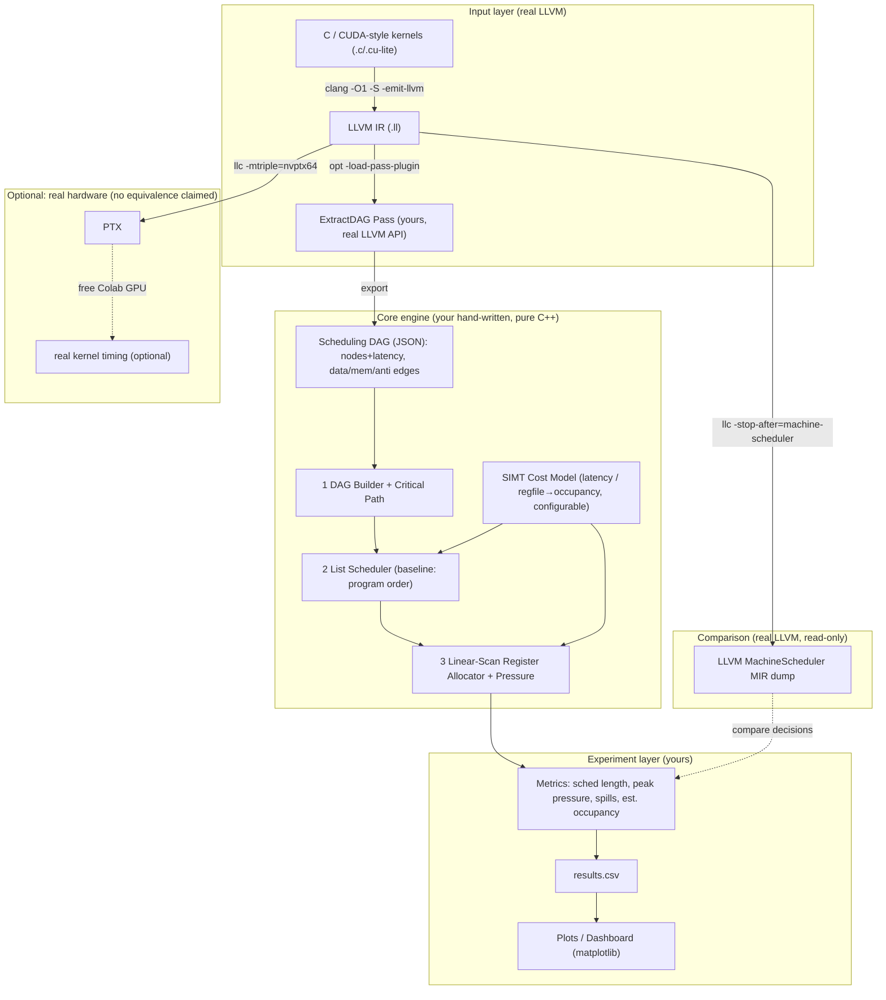

# 10-Day Hands-On Project Guide — LLVM Back End Compiler (aligned to NVIDIA JD)

> Target role: **NVIDIA Back End Compiler Team** (LLVM code generation / instruction scheduling / software pipelining / register allocation / GlobalISel / TableGen / LLVM IR / MIR / C++ / GPU-SIMT).
> This document designs a **10-day, 3–5 hours/day** hands-on compiler back-end project for you that is resume-worthy, open-sourceable, and defensible in deep interviews.
> **Link verification date: 2026-07-22.** All LLVM official docs are currently hosted under version `24.0.0git` (dev-branch docs; the URLs are stable — pin actual APIs to your local `llvm-config --version`).
> **Important honesty statement:** the project's core results are **static/simulated metrics driven by a cost model**, NOT real GPU hardware performance. Real-hardware validation is labeled *Optional* throughout, and we **never claim the simulated results equal real production/hardware performance**. Every performance number in this document is a placeholder — you must fill it in only after you actually run the experiments.

---

## 0. 10-Day Roadmap Overview

| Day | Theme | Key deliverable | Core module progress |
|----|------|------------|------------|
| 1 | Environment + LLVM back-end mental model | A working out-of-tree New-PM plugin pass (prints function names) | Scaffold |
| 2 | LLVM IR traversal + dependency extraction | Pass walks BB/Instruction, exports def-use dependencies as JSON | 1 DAG Builder (start) |
| 3 | Scheduling DAG + latency model | Full dependency DAG (data/anti/output/memory edges) + per-opcode latency table + critical path | 1 DAG Builder (done) |
| 4 | List Scheduler core | cycle-by-cycle list scheduling, outputs schedule length | 2 List Scheduler (done) |
| 5 | Live interval + register pressure | Compute live intervals, peak pressure, add pressure-aware priority | 3 RegAlloc (start) |
| 6 | Linear-scan Register Allocator | Linear-scan allocation + spill counting + occupancy estimate | 3 RegAlloc (done) |
| 7 | Benchmark corpus + harness | Kernel corpus (clang→IR), CSV output, baseline vs optimized runs | 4 Benchmark Harness |
| 8 | Run experiments + compare vs LLVM MachineScheduler | Data collection for three experiments, compared to `llc` built-in scheduler | Experiments |
| 9 | Charts / dashboard / tests / CI | Performance curves, GitHub Actions, unit tests | Delivery |
| 10 | README / report / resume / demo | Complete README, experiment report, resume bullets, demo recording | Delivery |

**Daily time budget template (3–5 hours):** Reading 45–90 min | Implementation 120–180 min | Experiment & debugging 30–60 min | Results write-up 20–30 min.

---

## 1. Deep JD Breakdown

### 1.1 Core technical skills
- **Full LLVM code-generation pipeline**: LLVM IR → SelectionDAG / GlobalISel → Machine IR (MIR) → register allocation → assembly/machine-code emission.
- **Instruction scheduling**: list scheduling, critical-path, latency hiding; **software pipelining** (MachinePipeliner / modulo scheduling).
- **Register allocation**: live interval, register pressure, spilling; (in the NVIDIA context) the strong coupling between register pressure and **occupancy**.
- **GlobalISel pipeline**: IRTranslator → Legalizer → RegBankSelect → InstructionSelect.
- **TableGen**: describing instructions, scheduling models (`SchedMachineModel` / itinerary), and register classes in a DSL.
- **MIR**: the machine-level IR's readable serialization format; `-run-pass` / `-stop-after` for isolated testing of back-end passes.
- **Strong C/C++ engineering**, **GPU / parallel SIMT architectures**, **CUDA/PTX** background as a plus.

### 1.2 The 3–5 most important hiring signals
1. **You genuinely understand the layered structure of LLVM back-end code generation**, not just how to use clang. You can explain the journey of one instruction from IR to machine code.
2. **You can implement back-end core algorithms by hand**: instruction scheduling and register allocation are this team's daily work — being able to hand-write them is a strong signal.
3. **Strong C++ + engineering best practices**: clear module boundaries, unit tests, CI, reproducible benchmarks.
4. **Quantification and experimental methodology**: you can design controlled experiments, report P50/P95, baseline vs optimized, and **honestly distinguish simulation from real hardware**.
5. **GPU/SIMT sensibility**: you understand the trade-off between latency hiding and register pressure/occupancy (the core tension in an NVIDIA back end).

### 1.3 Abilities you can genuinely demonstrate through the project within 10 days
- Hand-write a **list scheduler** (with critical-path priority, ready list, resource/latency constraints).
- Hand-write a **linear-scan register allocator** (live interval, spill, pressure).
- Write an out-of-tree pass with the **real LLVM C++ API** that extracts a dependency DAG from real IR.
- Design a **latency/occupancy cost model** and run sensitivity analysis.
- Do a behavioral comparison against LLVM's **built-in MachineScheduler** (same function, different scheduling decisions).
- A complete **benchmark harness + CSV + charts + CI**.

### 1.4 Abilities you **cannot truly demonstrate** in 10 days — only learn/simulate
- **Real end-to-end performance gains on a GPU** (needs GPU hardware + real kernel workload; this project simulates via a cost model, with real validation listed as Optional).
- **Production-grade GlobalISel / TableGen changes** (learn the concepts and pipeline, but no production contribution in 10 days).
- **A complete software pipelining (modulo scheduling) implementation** (concept learning + an optional stretch goal, not part of the main deliverable).
- **Real NVPTX back-end internal changes** (understand that it exists and what it does, but do not modify the in-tree back end).
- **Large-scale production-compiler tuning experience** (only approximable with a small corpus).

> **How to state this honestly on your resume/interview:** "I implemented an *offline, cost-model-driven* back-end scheduling and allocation engine using real LLVM IR as input; the results are cycle/pressure/spill metrics in the model's sense — I explicitly do not claim they equal real GPU throughput."

### 1.5 How the project connects to your existing background
- **C++/performance optimization** → hand-written scheduling/allocation algorithms, data-structure choices (DenseMap/SmallVector thinking), profiling.
- **CUDA/OpenMP/SIMT intuition** → the motivation for modeling memory-latency-hiding and occupancy in the cost model is natural.
- **Distributed/back-end engineering** → benchmark harness, CI, and reproducible experimental methodology transfer directly.
- **Prometheus/visualization** → results dashboard and performance curves.
- **Weak K8s does not affect this project**: it touches no K8s/CNCF at all and focuses purely on the compiler back end — playing to your strengths.

---

## 2. Project Selection and Naming

### 2.1 One-sentence definition
> **An out-of-tree LLVM "schedule + allocate" offline engine**: a real LLVM pass extracts an instruction-dependency DAG from LLVM IR, then **your hand-written** list scheduler, linear-scan register allocator, and **SIMT-aware latency/occupancy cost model** quantify schedule length, register pressure, spill count, and estimated occupancy for baseline vs optimized, and compare the decisions against LLVM's built-in MachineScheduler.

This is not CRUD, not a web app, not "just writing YAML." It maps directly to the JD's main responsibilities: **instruction scheduling + register allocation + LLVM code generation**.

### 2.2 GitHub project name (professional, accurate, usable)
**Recommended main name:**

```
mirsched — a register-pressure-aware LLVM instruction scheduler & allocator sandbox
```

Alternatives (pick one you like; keep it all-lowercase, hyphenated, no hype):
- `llvm-sched-lab`
- `occusched` (Occupancy-aware Scheduler, emphasizes the SIMT selling point)
- `dagsched`

> The rest of this document uses **`mirsched`** as the example.

### 2.3 Why this selection is Mac-completable and not overstated
- **No need to build LLVM from source** (optional): use Homebrew's prebuilt `llvm` (with headers + `opt`/`llc`/`clang` + a CMake config); the out-of-tree plugin compiles directly against it.
- **No GPU needed**: the core results are cost-model static metrics; real GPU (e.g., running PTX on a free Colab/Kaggle GPU) is only an Optional validation.
- **The main body is your own C++ engine**: LLVM only "turns real IR into DAG input"; the scheduling and allocation algorithms are yours — deeply explainable, thoroughly defensible.

---

## 3. System Architecture (Mermaid)



---

## 4. Recommended Tech Stack

| Layer | Choice | Notes |
|----|------|------|
| Compiler infrastructure | **LLVM (Homebrew `llvm`)** | Provides `clang`/`opt`/`llc` + headers + `LLVMConfig.cmake`. Record the version with `llvm-config --version`. |
| Core engine language | **C++17/20** | Hand-written scheduler/allocator; aligns with the JD's C/C++ requirement. |
| Build | **CMake ≥ 3.20 + Ninja** | Officially recommended; `find_package(LLVM CONFIG)`. |
| Pass mechanism | **New Pass Manager plugin** | `opt -load-pass-plugin=...`, no need to rebuild LLVM. |
| DAG interchange format | **JSON** (`nlohmann/json`, header-only) | Decouples "real LLVM extraction" from the "pure algorithm engine"; easy to unit-test. |
| Testing | **GoogleTest** or **Catch2** + **lit-style** inputs | Unit-test the algorithms + end-to-end small samples. |
| Data/plotting | **Python + pandas + matplotlib** | Generate performance curves, P50/P95 plots. |
| CI | **GitHub Actions** | Build engine + run unit tests + run a mini benchmark. |
| Optional hardware | **Google Colab (free GPU)** | Run llc-generated PTX, Optional. |

> **Version honesty:** Homebrew's `llvm` version changes over time (around LLVM 20/21 as of 2026-07). All code in this guide targets the **New Pass Manager plugin API**, which has been stable since LLVM 13+; if your local version differs, just adjust slightly against your local headers. **Record the actual `llvm-config --version` output and verification date in the README.**

---

## 5. GitHub Repository Structure and Directory Responsibilities

```
mirsched/
├── README.md                    # Project front door (structure in §11)
├── LICENSE                      # Apache-2.0 (consistent with the LLVM ecosystem)
├── CMakeLists.txt               # Top-level build
├── .github/workflows/ci.yml     # CI: build + unit tests + mini bench
│
├── pass/                        # [real LLVM] out-of-tree Pass
│   ├── CMakeLists.txt
│   └── ExtractDAG.cpp           # Walks IR, exports scheduling DAG (JSON)
│
├── engine/                      # [your core] pure C++ engine, no LLVM headers
│   ├── include/mirsched/
│   │   ├── Dag.h                # DAG data structure + JSON deserialization
│   │   ├── CostModel.h          # SIMT latency/occupancy model (configurable)
│   │   ├── ListScheduler.h
│   │   └── LinearScan.h
│   ├── src/
│   │   ├── Dag.cpp
│   │   ├── ListScheduler.cpp    # 2 core algorithm
│   │   ├── LinearScan.cpp       # 3 core algorithm
│   │   └── CostModel.cpp
│   └── tools/
│       └── mirsched-cli.cpp     # CLI: read DAG → schedule → allocate → print/CSV metrics
│
├── harness/                     # Experiment driver
│   ├── run_experiments.py       # Batch-run the corpus, produce results.csv
│   ├── plot.py                  # Generate charts
│   └── configs/                 # Experiment configs (latency parameter sweeps, etc.)
│
├── corpus/                      # Benchmark corpus
│   ├── src/                     # Small kernel sources (.c / cuda-style)
│   ├── ll/                      # clang-generated .ll (rebuildable by script)
│   └── build_corpus.sh
│
├── tests/                       # Unit tests
│   ├── test_scheduler.cpp
│   ├── test_linearscan.cpp
│   └── golden/                  # Hand-computed expected results for small DAGs
│
├── docs/
│   ├── ARCHITECTURE.md          # Architecture, algorithm pseudocode, design trade-offs
│   ├── COST_MODEL.md            # Cost-model assumptions and limits (honesty statement)
│   └── REPORT.md                # Experiment report (structure in §12)
└── results/
    ├── results.csv              # Raw data (commit after running)
    └── figures/                 # Generated figures
```

**One-line directory responsibilities:**
- `pass/`: the only part that depends on LLVM headers; translates "real-world IR" into DAGs the engine can consume.
- `engine/`: the soul of the project, the **main interview battleground**; pure algorithms, unit-testable without LLVM.
- `harness/`: the vehicle for scientific experimental methodology (reproducible, sweepable).
- `corpus/`: the input distribution that makes results meaningful.
- `tests/` + `.github/`: engineering best practices (explicitly required by the JD).
- `docs/`: clearly writing down the "honest limitations" is itself a plus.

---

## 6. Core Modules in Detail (≥2 non-vibe-coding modules)

> This project has **3** modules you must implement by hand and can defend deeply: 1 DAG Builder, 2 List Scheduler, 3 Linear-Scan Register Allocator. Plus 4 Benchmark Harness (semi-automatic).

### Module 1 — Scheduling DAG Builder (incl. critical-path)
- **Input**: the instruction sequence of a single basic block (or scheduling region) (from the ExtractDAG pass's JSON: each instruction's opcode, SSA def, SSA uses, whether it's a load/store).
- **Output**: a directed acyclic graph `G=(V,E)`, nodes = instructions (with latency), edges = dependencies (`data` / `memory` / `anti` / `output`), plus each node's `critical_path_height` (longest weighted path to the sink).
- **Data structures**: `std::vector<Node>` (`id, opcode, latency, succ[], pred[], cpHeight`); a `DenseMap<SSAValue, NodeId>` recording def locations.
- **Key algorithms**:
  - Dependency construction: SSA naturally gives data deps (use→def); memory deps use a conservative rule (within one BB, add ordering edges among load/store in program order, unless non-aliasing can be proven — this project takes the conservative choice).
  - Critical path: reverse-topological DP over the DAG: `cpHeight(n) = latency(n) + max_{s∈succ} cpHeight(s)`.
- **Concurrency model**: single-threaded (DAG construction is per-region sequential logic; corpus-level parallelism goes in the harness layer via multiple processes over multiple functions).
- **Failure handling**: non-DAG (guaranteed acyclic here since it's within a single BB in definition order); missing def (cross-BB value) → mark as a region-entry live-in, add no internal edge.
- **Metrics**: node count, edge count, critical path length (part of the theoretical lower bound).
- **Testing method**: hand-compute cpHeight golden values for 3–4 small DAGs, compare in unit tests.
- **Likely interview follow-ups**:
  - "Why are there still anti/output dependencies under SSA?" (Answer: WAR/WAW appear at the register level; the IR/SSA level is mainly memory and data; anti/output only surface after register allocation — which is exactly what your Module 3 handles.)
  - "How do you model memory dependency? Why conservative? What does alias analysis buy you?"

### Module 2 — List Scheduler (main algorithm)
- **Input**: Module 1's DAG + CostModel (latency table, issue width / resource slots).
- **Output**: the issue-cycle sequence `schedule[]`, plus the **schedule length (total cycle count)**.
- **Data structures**: `ready list` (priority-sorted, using `std::priority_queue` or an ordered `vector`); per-node `unscheduledPreds` counter; `std::vector<int> readyCycle`.
- **Key algorithm (cycle-by-cycle list scheduling)**:
  ```
  compute cpHeight for all nodes            // priority source
  ready = { n : indeg(n)==0 }
  cycle = 0
  while not all scheduled:
      avail = { n in ready : readyCycle[n] <= cycle }
      sort avail by priority:
          1) larger cpHeight first (critical path)
          2) tie-break: lower register-pressure increase (introduced Day 5)
      issue up to IssueWidth nodes (bounded by resource slots)
      for each issued n:
          for s in succ(n):
              readyCycle[s] = max(readyCycle[s], cycle + latency(n,edge))
              if --unscheduledPreds[s]==0: ready.add(s)
      cycle++
  return schedule, length=cycle
  ```
- **Concurrency model**: single-threaded deterministic (reproducibility is an experimental prerequisite).
- **Failure handling**: ready list empty but nodes remain unscheduled → indicates a hidden cycle / graph-building bug → assert and dump the DAG.
- **Metrics**: schedule length; gap relative to the critical-path lower bound; stall-cycle count.
- **Testing method**: (a) compare against hand-computed small-sample goldens; (b) property test: every dependency edge satisfies `issue(pred)+latency ≤ issue(succ)`; (c) baseline (program order) must be ≥ your scheduled length (else a bug).
- **Likely interview follow-ups**:
  - "List scheduling is a heuristic — when is it far from optimal? Why do back ends still use it instead of optimal scheduling?" (NP-hard; compile-time constraints.)
  - "Top-down vs bottom-up list scheduling? LLVM's MachineScheduler is bidirectional — why?"
  - "Why does your priority function use critical-path height? What other heuristics exist (e.g., register pressure, mobility/slack)?"
  - "How does software pipelining relate to list scheduling? (across iterations vs within a region)"

### Module 3 — Linear-Scan Register Allocator (+ pressure/occupancy)
- **Input**: the linear schedule from Module 2 + a physical register budget `K` (configurable, to simulate different architecture/occupancy targets).
- **Output**: each virtual register → a physical register or spill slot; **spill count**, **peak register pressure**, **estimated occupancy**.
- **Data structures**: `LiveInterval{vreg, start, end}`; a list sorted by start; an `active` list sorted by end; a free physical-register pool.
- **Key algorithm (classic Poletti–Sarkar linear scan)**:
  ```
  build live intervals from the schedule (def=first, use=last position)
  sort intervals by start
  active = []; free = {p0..p_{K-1}}
  for iv in intervals sorted by start:
      expireOld(iv.start)              // return registers whose end < start
      if |active| == K:
          spill = active with farthest end
          if spill.end > iv.end: assign spill's reg to iv; spill it;
          else: spill iv
      else:
          iv.reg = free.pop(); active.add(iv)
  spillCount = #spilled
  ```
- **Occupancy estimate (the SIMT selling point, explicitly labeled a modeling assumption)**: `estOccupancy = floor(RegFileSizePerSM / (peakPressure * threadsPerWarp)) ...` — a **simplified, documented** formula expressing the directional relationship "higher register pressure → fewer concurrent warps." **State clearly in `docs/COST_MODEL.md`: this is directional modeling, not real occupancy.**
- **Concurrency model**: single-threaded deterministic.
- **Failure handling**: `K < the minimum requirement at some point` → spilling is inevitable; count it correctly rather than crashing; illegal interval endpoints → assert.
- **Metrics**: spill count; peak pressure; estimated extra memory traffic from spill/reload; estimated occupancy.
- **Testing method**: (a) hand-compute small samples; (b) invariant: at any cycle, the number of simultaneously-live, non-spilled vregs ≤ K; (c) with very large K, spills = 0.
- **Likely interview follow-ups**:
  - "Linear scan vs graph coloring (Chaitin–Briggs) trade-offs? Why do JITs often use the former and -O2 the latter?"
  - "Why do live-interval 'lifetime holes' make basic linear scan suboptimal? How do second-chance / SSA-based approaches improve it?"
  - "How exactly do register pressure and GPU occupancy couple? Why must the scheduler in an NVIDIA back end be pressure-aware?"
  - "What's the intuition behind spilling the farthest-end interval? Relation to Belady?"

### Module 4 — Benchmark Harness / Load Generator (semi-automatic)
- **Input**: `corpus/ll/*.ll` + experiment config (latency parameters, K sweep).
- **Output**: `results.csv` (each row: kernel, config, mode(baseline/opt), sched_len, peak_pressure, spills, est_occ) + charts.
- **Key points**: reproducible (fixed corpus, fixed seed, recorded environment), sweepable, multiple runs for statistics (even though the algorithm is deterministic, running multiple times verifies CLI/IO stability and statistical bookkeeping).
- **Interview follow-up**: "How do you ensure experiments are reproducible? What are the confounding factors?"

---

## 7. Experiment Design (≥3, results left blank to fill later)

> **Never pre-fill numbers.** The "expected figure/conclusion" below only describes **directional hypotheses** and figure shapes; actual percentages, P50/P95, etc., go into `docs/REPORT.md` only after running.

### Experiment 1: Latency-aware list scheduling vs program-order baseline
- **Hypothesis**: Under a cost model with non-zero instruction latencies, list scheduling lowers modeled schedule length, especially for kernels with high-latency instructions (loads/special functions).
- **Independent variable**: scheduling policy (baseline=program order vs optimized=critical-path list scheduling).
- **Controlled variables**: same corpus, same CostModel, same IssueWidth, same register budget.
- **Metrics**: schedule length (cycles); gap relative to the critical-path lower bound.
- **Runs**: ≥5 per kernel × policy (confirm determinism & IO stability), report the median.
- **Baseline**: program order.
- **Optimized**: your list scheduler.
- **Expected graph**: grouped bar chart (x=kernel, y=sched length, two colors baseline/opt) + a "per-kernel improvement %" bar chart.
- **Confounding factors**: corpus too small/too regular; if the CostModel sets all latencies to 1, scheduling yields no benefit (note this in the report).
- **Conclusions you CAN draw**: the direction and magnitude of scheduling's effect on schedule length **under this model**.
- **Conclusions you CANNOT draw**: wall-clock speedup on a real GPU.

### Experiment 2: The length↔pressure trade-off of pressure-aware scheduling
- **Hypothesis**: Adding a register-pressure-aware tie-break **lowers peak pressure / spill count** but may **slightly increase schedule length** (the classic trade-off).
- **Independent variable**: priority function (pure critical-path vs pressure-aware).
- **Controlled**: corpus, CostModel, register budget K.
- **Metrics**: peak pressure, spill count, schedule length (look at all three together).
- **Runs**: ≥5.
- **Baseline**: pure critical-path scheduler (the optimized one from Experiment 1).
- **Optimized/Alternative**: pressure-aware scheduler.
- **Expected graph**: scatter plot (x=schedule length, y=spill count), observing the Pareto-front shift.
- **Confounding**: if K is too large → no spills → no visible difference (sweep multiple K values).
- **Can draw**: whether the trade-off exists and its direction. **Cannot draw**: which is faster on real hardware.

### Experiment 3: Cost-model sensitivity (memory-latency sweep) — SIMT relevance
- **Hypothesis**: The larger the memory-latency parameter (closer to a GPU's high-latency global memory), the larger the schedule-length benefit of scheduling (latency hiding matters more).
- **Independent variable**: memory-latency parameter (e.g., {2, 8, 32, 128, 400} cycles).
- **Controlled**: corpus, policy, K.
- **Metrics**: optimized-vs-baseline schedule-length improvement % vs latency.
- **Runs**: ≥5 per latency point.
- **Baseline/Optimized**: program order vs list scheduler, run at each latency point.
- **Expected graph**: line chart (x=memory latency (log), y=improvement %), hypothesized to rise monotonically then saturate.
- **Confounding**: if a kernel has too few loads, the curve is flat; the corpus needs memory-bound kernels.
- **Can draw**: the relationship in the model between latency and scheduling benefit (echoing the "GPU latency hiding" motivation). **Cannot draw**: real occupancy/throughput numbers.

### (Optional) Experiment 4: Register-budget K sweep → spill & estimated-occupancy curves
- Sweep K and plot spill count and est-occupancy vs K (roofline-ish). Clearly label occupancy as a model estimate.

### (Optional) Experiment 5: Real-hardware corroboration (**no equivalence claimed**)
- `llc -mtriple=nvptx64-nvidia-cuda kernel.ll -o kernel.ptx`, load and time the PTX on a free Colab GPU. **Purely directional corroboration**; report separately and stress "different scheduler, different abstraction layer, not directly equatable to this project's model metrics."

---

## 8. Detailed 10-Day Plan (10 items per day, directly followable)

> Conventions: `$LLVM = $(brew --prefix llvm)`; on macOS the plugin artifact is **`.dylib`** (not `.so`); **be sure to use Homebrew's `opt/llc/clang`** (`$LLVM/bin/...`) so it matches the LLVM version the plugin was compiled against.

---

### Day 1 — Environment & LLVM back-end mental model

1. **Goals**: Set up the toolchain; scaffold the repo; get a working **out-of-tree New-PM plugin pass** (prints function names); be able to explain "the journey of one instruction through the LLVM back end."
2. **Time allocation**: Reading 60–75 min | Implementation 120 min | Debugging 45 min | Write-up 20 min.
3. **Reading**:
   - **[Required]** [Life of an instruction in LLVM (Eli Bendersky)](https://eli.thegreenplace.net/2012/11/24/life-of-an-instruction-in-llvm) — full article, ~20 min. **After reading you should understand**: the full chain IR → SelectionDAG(SDNode) → Legalize → ISel(MachineSDNode) → MachineInstr → RegAlloc → MC/emission.
   - **[Required]** [Writing an LLVM Pass (New PM)](https://llvm.org/docs/WritingAnLLVMNewPMPass.html) — read **Introduction / Quick Start (Hello World) / Running with opt / the plugin part of the FAQ (`add_llvm_pass_plugin` and `llvmGetPassPluginInfo`)**; **skip** the lit Testing details (revisit Day 9), ~30 min. **After reading you should understand**: how to register pipeline callbacks with `PassBuilder` and how `opt -load-pass-plugin` loads them.
   - **[Required]** [Getting Started](https://llvm.org/docs/GettingStarted.html) — read only **Requirements / the software version table** (CMake≥3.20, Ninja, Apple Clang version), ~10 min. **After reading you should understand**: build prerequisites (this project uses Homebrew to avoid building, so this is background only).
4. **Questions to answer after reading**:
   - Does MachineInstr appear before or after register allocation?
   - Which symbol lets `opt` discover a New PM plugin? (`llvmGetPassPluginInfo`)
   - Why must an out-of-tree plugin match `opt`'s LLVM version?
5. **Implementation tasks**:
   ```bash
   brew install llvm cmake ninja
   export LLVM=$(brew --prefix llvm)
   $LLVM/bin/llvm-config --version   # record in README
   ```
   Create `pass/ExtractDAG.cpp` (today just prints function names) + `pass/CMakeLists.txt`:
   ```cpp
   // pass/ExtractDAG.cpp (Day 1 version)
   #include "llvm/IR/Function.h"
   #include "llvm/IR/PassManager.h"
   #include "llvm/Passes/PassBuilder.h"
   #include "llvm/Support/raw_ostream.h"

   // GOTCHA (verified on LLVM 22.1.8, 2026-07-22): PassPlugin.h moved from
   // llvm/Passes/ to llvm/Plugins/ in LLVM 22. This guard works on both.
   #if __has_include("llvm/Plugins/PassPlugin.h")
   #include "llvm/Plugins/PassPlugin.h"
   #else
   #include "llvm/Passes/PassPlugin.h"
   #endif

   using namespace llvm;
   namespace {
   struct ExtractDAG : PassInfoMixin<ExtractDAG> {
     PreservedAnalyses run(Function &F, FunctionAnalysisManager &) {
       errs() << "[mirsched] function: " << F.getName() << "\n";
       return PreservedAnalyses::all();
     }
   };
   } // namespace
   extern "C" LLVM_ATTRIBUTE_WEAK ::llvm::PassPluginLibraryInfo
   llvmGetPassPluginInfo() {
     return {LLVM_PLUGIN_API_VERSION, "mirsched", LLVM_VERSION_STRING,
       [](PassBuilder &PB) {
         PB.registerPipelineParsingCallback(
           [](StringRef Name, FunctionPassManager &FPM,
              ArrayRef<PassBuilder::PipelineElement>) {
             if (Name == "extract-dag") { FPM.addPass(ExtractDAG()); return true; }
             return false;
           });
       }};
   }
   ```
   ```cmake
   # pass/CMakeLists.txt
   cmake_minimum_required(VERSION 3.20)

   # GOTCHA 1: C must be enabled — AddLLVM/HandleLLVMOptions run C compiler and
   # linker checks and hard-error with "C: needs to be enabled before use".
   project(mirsched_pass LANGUAGES C CXX)

   # GOTCHA 2: LLVM 16+ headers need C++17; set it BEFORE the target is created
   # or you get "unknown type name 'constexpr'" from llvm/ADT/ADL.h.
   set(CMAKE_CXX_STANDARD 17)
   set(CMAKE_CXX_STANDARD_REQUIRED ON)
   set(CMAKE_CXX_EXTENSIONS OFF)

   find_package(LLVM REQUIRED CONFIG)
   list(APPEND CMAKE_MODULE_PATH ${LLVM_CMAKE_DIR})
   include(AddLLVM)
   include(HandleLLVMOptions)

   # GOTCHA 3: without these the plugin cannot find any <llvm/...> header.
   separate_arguments(LLVM_DEFINITIONS_LIST NATIVE_COMMAND "${LLVM_DEFINITIONS}")
   add_definitions(${LLVM_DEFINITIONS_LIST})
   include_directories(SYSTEM ${LLVM_INCLUDE_DIRS})

   add_llvm_pass_plugin(MirSchedPass ExtractDAG.cpp)
   ```

   > The three gotchas above were hit and fixed for real on LLVM 22.1.8 (Homebrew,
   > macOS arm64) on 2026-07-22. Most online plugin tutorials predate them.
   ```bash
   cmake -S pass -B pass/build -G Ninja -DLLVM_DIR=$LLVM/lib/cmake/llvm
   ninja -C pass/build
   echo 'define i32 @add(i32 %a,i32 %b){ %s=add i32 %a,%b  ret i32 %s }' > /tmp/t.ll
   $LLVM/bin/opt -load-pass-plugin=pass/build/MirSchedPass.dylib \
        -passes=extract-dag -disable-output /tmp/t.ll
   ```
6. **Must implement by hand**: pass registration code, CMake integration, getting the command to run (this is the foundation for the next 9 days — you must walk through the environment pitfalls yourself).
7. **Can be vibe coding**: `.gitignore`, README initial skeleton, LICENSE-choice notes.
8. **Experiment design**: none (today is an environment day). Optional: wrap the commands above in `scripts/run_pass.sh` for reuse.
9. **Acceptance criteria**: `opt` successfully loads the `.dylib` and prints function names; `llvm-config --version` is recorded; the repo passes `cmake && ninja`.
10. **GitHub outputs**: `pass/ExtractDAG.cpp`, `pass/CMakeLists.txt`, `README.md` (with environment version and verification date), `scripts/run_pass.sh`.

---

### Day 2 — LLVM IR traversal & dependency extraction

1. **Goals**: Make the pass actually walk BasicBlock/Instruction, use `dyn_cast` to identify instructions, extract **def-use data dependencies**, and export as JSON (start with a single BB).
2. **Time allocation**: Reading 60 min | Implementation 150 min | Debugging 45 min | Write-up 20 min.
3. **Reading**:
   - **[Required]** [LLVM Programmer's Manual](https://llvm.org/docs/ProgrammersManual.html) — read only **"Basic Inspection and Traversal Routines"** (traversing F→BB→I), **"The isa<>, cast<> and dyn_cast<> templates"**, and the **SmallVector/DenseMap paragraphs in "Picking the Right Data Structure"**; **skip** threading/serialization and other advanced chapters, ~35 min. **After reading you should understand**: how to safely traverse and type-discriminate instructions, why to use DenseMap to store Value→NodeId.
   - **[Optional]** [How Clang compiles a function (John Regehr)](https://blog.regehr.org/archives/1605) — full article, ~15 min. **After reading you should understand**: clang emits "degenerate SSA" in alloca/load/store form by default; only after `-O1/-mem2reg` do you get clean SSA (this affects the shape of the dependencies you extract).
4. **Questions to answer after reading**:
   - How do you tell whether an `Instruction*` is a load/store/binary op? (`dyn_cast<LoadInst>` etc.)
   - Why, under SSA, is a "data dependency" equivalent to "a use → its def instruction"?
   - Why does running `-mem2reg`/`-O1` before extraction produce a more meaningful DAG?
5. **Implementation tasks**: Bring in `nlohmann/json` (header-only, put in `engine/third_party/`). Extend the pass: for each function pick the **BB with the most instructions** as the scheduling region, build a node per instruction, iterate `operand`s, and if an operand's def is in the same BB add a `data` edge; mark `isLoad/isStore`. Export `corpus/dag/<func>.json`:
   ```json
   {"function":"saxpy","block":"entry",
    "nodes":[{"id":0,"opcode":"load","isLoad":true},
             {"id":1,"opcode":"fmul","isLoad":false}],
    "edges":[{"from":0,"to":1,"kind":"data"}]}
   ```
   Do not do latency/critical-path yet (Day 3).
6. **Must implement by hand**: IR traversal + `dyn_cast` discrimination + def-use edge construction (this is the evidence that "you can use the real LLVM API").
7. **Can be vibe coding**: JSON serialization boilerplate, the glue that converts node/edge structs to JSON.
8. **Experiment design**: no formal experiment; do a **correctness sanity check**: hand-write a 3-instruction `.ll` and eyeball whether the exported edges equal the def-use relations.
9. **Acceptance criteria**: for 2–3 hand-written `.ll`s, the data edges in the exported JSON match the def-use graph you drew by hand.
10. **GitHub outputs**: updated `pass/ExtractDAG.cpp`, `engine/third_party/json.hpp`, sample `corpus/dag/*.json`, `docs/ARCHITECTURE.md` (recording the DAG JSON schema).

---

### Day 3 — Scheduling DAG + latency model + critical path

1. **Goals**: Finish Module 1. Add **memory dependency edges** (conservative order), a **latency table (CostModel prototype)**, and on the **engine side** read the JSON to build the DAG and compute **critical-path height**.
2. **Time allocation**: Reading 75 min | Implementation 150 min | Debugging 40 min | Write-up 20 min.
3. **Reading**:
   - **[Required]** [The LLVM Target-Independent Code Generator](https://llvm.org/docs/CodeGenerator.html) — read **"Introduction / High-level design of the code generator"** and **"SelectionDAG Scheduling and Formation Phase"** (understand how the real back end linearizes instructions from a DAG); **skip** the SelectionDAG Legalize sub-phase details and specific target hooks, ~40 min. **After reading you should understand**: why scheduling operates on a DAG, the concept of a scheduling region, where latency comes from (SchedModel).
   - **[Optional]** [TableGen Overview](https://llvm.org/docs/TableGen/index.html) — read only the opening **"What is TableGen"**, ~10 min. **After reading you should understand**: in real LLVM, per-opcode latency is generated by TableGen's `SchedMachineModel` — your hand-written latency table is a minimal version of it (compare and contrast in the interview).
4. **Questions to answer after reading**:
   - Real LLVM scheduling operates on a "scheduling region" (usually a BB or a slice of one) — is that the same granularity as your implementation?
   - Where does the real latency data come from? (TableGen SchedModel / itinerary)
   - Why can critical-path height serve as a scheduling priority?
5. **Implementation tasks**:
   - `engine/include/mirsched/CostModel.h`: `latency(opcode)`, configurable (memory=large, alu=small), read from `harness/configs/*.json`.
   - `engine/src/Dag.cpp`: JSON→`Dag`; add memory edges (within a region, load/store in id order: store→subsequent load/store, load→subsequent store); compute `cpHeight` via reverse-topological DP.
   - `engine/tools/mirsched-cli.cpp`: `mirsched dag.json --dump` prints nodes/edges/cpHeight.
6. **Must implement by hand**: the memory-dependency rule, topological sort, and critical-path DP (all high-frequency interview topics).
7. **Can be vibe coding**: CLI argparse, JSON reading boilerplate, pretty-printing.
8. **Experiment design**: none; **invariant test**: cpHeight is non-increasing along any edge (`cpHeight(pred) ≥ cpHeight(succ)+latency`), encode this in unit tests.
9. **Acceptance criteria**: for the golden small DAG, cpHeight matches your hand computation; memory edges are added correctly per the rule.
10. **GitHub outputs**: `engine/include/mirsched/{Dag.h,CostModel.h}`, `engine/src/{Dag.cpp,CostModel.cpp}`, `engine/tools/mirsched-cli.cpp`, `tests/golden/*.json`, updated `docs/COST_MODEL.md` (clearly stating latency assumptions and limits).

---

### Day 4 — List Scheduler core (Module 2 done)

1. **Goals**: Implement cycle-by-cycle **list scheduling** (critical-path priority + IssueWidth constraint), output the schedule and schedule length; baseline = program order.
2. **Time allocation**: Reading 45 min | Implementation 180 min | Debugging 45 min | Write-up 20 min.
3. **Reading**:
   - **[Required]** [Code Generator](https://llvm.org/docs/CodeGenerator.html) — reread **"SelectionDAG Scheduling"** and skim the paragraphs mentioning **MachineScheduler / pre-RA scheduler**; **skip** specific APIs, ~25 min. **After reading you should understand**: LLVM's list scheduler uses a ready queue + priority, isomorphic to what you write.
   - **[Optional]** [llc Command Guide](https://llvm.org/docs/CommandGuide/llc.html) — skim what debug switches exist; the real `-run-pass`/`-stop-after`/`-debug-only` are best confirmed via `llc -help-hidden`, ~15 min. **After reading you should understand**: how to dump LLVM's own scheduling result for comparison on Day 8.
4. **Questions to answer after reading**:
   - Which steps does top-down list scheduling do each cycle?
   - Why do you need `readyCycle` (nodes whose latency isn't satisfied can't issue early)?
   - How do IssueWidth/resource slots limit the number of issues in one cycle?
5. **Implementation tasks**: `engine/src/ListScheduler.cpp` implements the §6.2 pseudocode above; `Baseline` mode = original id order but still respects latencies (measures the cost of "not reordering"). CLI: `mirsched dag.json --sched=list|program --issue=2`, output `schedule_length`.
6. **Must implement by hand**: ready-list maintenance, priority sorting, `readyCycle` propagation, the issue loop (**the most core 100–200 lines of the whole project**).
7. **Can be vibe coding**: CLI argument parsing, text/JSON printing of the schedule.
8. **Experiment design (Experiment 1 prototype)**: for 3–5 DAGs, compare `--sched=program` vs `--sched=list` on length; first check the direction is right (list ≤ program).
9. **Acceptance criteria**: all dependency constraints satisfied (write invariant assertions); list ≤ program; small samples match hand-computed optimal/near-optimal.
10. **GitHub outputs**: `engine/{include,src}/.../ListScheduler.*`, `tests/test_scheduler.cpp`, CLI update, `docs/ARCHITECTURE.md` with the scheduler pseudocode.

---

### Day 5 — Live interval & register pressure (Module 3 start)

1. **Goals**: From the schedule, compute **live intervals** and **peak register pressure**; add **pressure-aware tie-break** to the list scheduler.
2. **Time allocation**: Reading 60 min | Implementation 150 min | Debugging 45 min | Write-up 20 min.
3. **Reading**:
   - **[Required]** [Code Generator — Register Allocation section](https://llvm.org/docs/CodeGenerator.html) — read the **"Register Allocation"** opening + the relevant notes on **"Mapping virtual to physical registers"/"live intervals"**; **skip** specific allocator implementation classes, ~30 min. **After reading you should understand**: the definitions and roles of live interval, register pressure, and spill.
   - **[Optional]** [MIR Language Reference](https://llvm.org/docs/MIRLangRef.html) — read only **Introduction + "MIR Testing Guide" (`-run-pass`, `-stop-after`)**; **skip** the 18-operand details, ~20 min. **After reading you should understand**: how, on Day 8, to isolate-test back-end passes via MIR and dump machine-level results.
4. **Questions to answer after reading**:
   - What is the definition of register pressure at a given cycle? (the number of vregs simultaneously live at that cycle)
   - Why does the "schedule order" change pressure?
   - What's the intuition linking pressure and GPU occupancy?
5. **Implementation tasks**: `LiveInterval` computation (def=first appearance cycle, last-use=last cycle it's used); scan all cycles to get peak pressure; in the scheduler's priority add a secondary key: when cpHeight ties, prefer a node that "doesn't/least increases the current live set" when issued.
6. **Must implement by hand**: pressure computation, pressure-aware priority logic.
7. **Can be vibe coding**: CSV/printing of pressure over cycles.
8. **Experiment design (Experiment 2 prototype)**: for the same DAG, pure-cpHeight vs pressure-aware, compare peak pressure and length, observe the trade-off.
9. **Acceptance criteria**: peak pressure is correct against hand computation on small samples; the pressure-aware mode indeed lowers peak pressure on some samples.
10. **GitHub outputs**: `LiveInterval`-related code, scheduler priority update, additional `tests`, sample raw data for pressure curves.

---

### Day 6 — Linear-Scan Register Allocator (Module 3 done)

1. **Goals**: Implement **linear-scan allocation + spill counting + estimated occupancy**; given a physical register budget K.
2. **Time allocation**: Reading 50 min | Implementation 170 min | Debugging 45 min | Write-up 20 min.
3. **Reading**:
   - **[Required]** reread the spilling paragraphs in [Code Generator — Register Allocation](https://llvm.org/docs/CodeGenerator.html), ~15 min.
   - **[Required]** [NVPTX Usage Guide](https://llvm.org/docs/NVPTXUsage.html) — read **Introduction / Conventions (kernel, address space) / the closing Tutorial (a compute-kernel example)**; **skip** the entire intrinsics list and libdevice details, ~30 min. **After reading you should understand**: the PTX/register-and-occupancy context, giving your occupancy model a "directional basis" (and knowing its limits).
4. **Questions to answer after reading**:
   - When does linear scan trigger a spill? Which interval does it spill? Why?
   - On a GPU, registers are a scarce resource — how does that affect resident threads/warps per SM (occupancy)?
   - Why can your occupancy only be an "estimate"?
5. **Implementation tasks**: `engine/src/LinearScan.cpp` (§6.3 pseudocode); `--regs=K`; output spill count; `estOccupancy = f(peakPressure, K/regfile)` (write the formula into `docs/COST_MODEL.md`, labeling assumptions).
6. **Must implement by hand**: the linear-scan main loop, active-set maintenance, spill selection, occupancy formula.
7. **Can be vibe coding**: tabular output of allocation results, CSV column assembly.
8. **Experiment design (Experiment 4 prototype)**: sweep K∈{4,8,16,32}, record spills and est-occupancy.
9. **Acceptance criteria**: the invariant "non-spilled live vregs ≤ K at any cycle" always holds; large K → spills=0; small samples match hand computation.
10. **GitHub outputs**: `LinearScan.*`, `test_linearscan.cpp`, CLI supporting `--regs`, updated `docs/COST_MODEL.md` (occupancy assumptions and disclaimer).

---

### Day 7 — Benchmark corpus + harness

1. **Goals**: Build the kernel corpus (clang→`.ll`), write `run_experiments.py` to batch-produce `results.csv`, and get the full baseline vs optimized chain running.
2. **Time allocation**: Reading 40 min | Implementation 160 min | Debugging 60 min | Write-up 30 min.
3. **Reading**:
   - **[Optional]** [NVPTX Usage — Executing PTX section](https://llvm.org/docs/NVPTXUsage.html) — read only the execution/testing subsections, ~15 min. **After reading you should understand**: how the Optional real-hardware validation would run (Day 10/later).
   - **[Optional]** [MIR Testing Guide](https://llvm.org/docs/MIRLangRef.html) — reread `-stop-after` usage, ~10 min. **After reading you should understand**: how to grab dumps from the real pipeline for the comparison experiment.
4. **Questions to answer after reading**:
   - What "types" of kernel should the corpus contain to make the experiments meaningful? (compute-bound, memory-bound, high/low ILP)
   - How do you ensure reproducibility (fixed corpus, fixed config, recorded environment)?
5. **Implementation tasks**:
   - `corpus/src/`: write 6–10 small kernels (saxpy, dot, gemm-tile-lite, stencil, reduction, conv1d…, plain C, with memory-bound/compute-bound variants).
   - `corpus/build_corpus.sh`: `clang -O1 -S -emit-llvm ...` → `.ll` (use `-O1` for clean SSA).
   - `harness/run_experiments.py`: for each `.ll`, run the pass to extract the DAG → run the engine in each mode → aggregate into `results.csv`.
6. **Must implement by hand**: the corpus kernels (showing you understand workload characteristics), harness orchestration and CSV schema.
7. **Can be vibe coding**: subprocess-call boilerplate, CSV writing, the `build_corpus.sh` scaffold.
8. **Experiment design**: finalize the config files for Experiments 1/2/3 (`harness/configs/`).
9. **Acceptance criteria**: one command `python harness/run_experiments.py` produces a complete `results.csv` (all kernels × modes × configs).
10. **GitHub outputs**: `corpus/` (src+scripts), `harness/run_experiments.py`, `harness/configs/*.json`, an initial `results/results.csv`.

---

### Day 8 — Run experiments + compare vs LLVM MachineScheduler

1. **Goals**: Formally run Experiments 1/2/3 (each ≥5 times), collect data; use `llc` to dump LLVM's own scheduling/machine-level results for a **behavioral comparison**.
2. **Time allocation**: Reading 45 min | Implementation/scripting 90 min | Experiment & debugging 120 min | Write-up 30 min.
3. **Reading**:
   - **[Required]** [MIR Language Reference](https://llvm.org/docs/MIRLangRef.html) — read **"MIR Testing Guide"** (`-run-pass=machine-scheduler`, `-stop-after`), ~20 min. **After reading you should understand**: how to get the MIR after LLVM's MachineScheduler.
   - **[Optional]** [Code Generator](https://llvm.org/docs/CodeGenerator.html) — reread the MachineScheduler section, ~15 min.
4. **Questions to answer after reading**:
   - What does `llc -stop-after=machine-scheduler kernel.ll -o k.mir` produce?
   - How should you **qualitatively** interpret the differences between your schedule and LLVM's (different cost model/target architecture, no numeric equivalence)?
5. **Implementation tasks**:
   ```bash
   $LLVM/bin/llc -mtriple=nvptx64-nvidia-cuda \
     -stop-after=machine-scheduler corpus/ll/saxpy.ll -o results/saxpy.misched.mir
   ```
   Write `harness/compare_llvm.py`: parse the MIR's instruction order and do a **qualitative** comparison with your schedule's order (e.g., Kendall-tau similarity), **explicitly labeled for qualitative discussion only**. Run Experiments 1/2/3 to completion.
6. **Must implement by hand**: experiment orchestration, and the comparison logic and interpretation against the LLVM dump.
7. **Can be vibe coding**: MIR text-parsing boilerplate, statistics-script scaffolding.
8. **Experiment design**: fully execute per §7; write the raw numbers into `results.csv` (**only now do you have real numbers**).
9. **Acceptance criteria**: `results.csv` contains complete data for all three experiments; there is a qualitative "you vs LLVM scheduling order" comparison for at least one kernel.
10. **GitHub outputs**: filled `results/results.csv`, `results/*.mir`, `harness/compare_llvm.py`, `docs/REPORT.md` (fill the data tables first; conclusions on Day 9/10).

---

### Day 9 — Charts / dashboard / tests / CI

1. **Goals**: Generate all charts; complete the unit tests; set up GitHub Actions CI.
2. **Time allocation**: Reading 30 min | Implementation 180 min | Debugging 45 min | Write-up 30 min.
3. **Reading**:
   - **[Required]** [Writing an LLVM Pass — Testing section](https://llvm.org/docs/WritingAnLLVMNewPMPass.html) — read the lit/testing section, ~15 min. **After reading you should understand**: how to write regression tests for the pass (optionally include in CI).
   - **[Optional]** GitHub Actions official "Building and testing C/C++" (`https://docs.github.com/en/actions/automating-builds-and-tests/building-and-testing-c-cpp`) — read only the workflow skeleton, ~15 min.
4. **Questions to answer after reading**:
   - Which parts can run fully automatically in CI (engine unit tests, mini benchmark)? Which aren't suitable (real GPU)?
   - Which conclusions should the charts present (against §7's expected graphs)?
5. **Implementation tasks**: `harness/plot.py` (use matplotlib for Experiments 1/2/3 charts + a P50/P95 summary); complete `tests/`; `.github/workflows/ci.yml`: install LLVM (or just build the LLVM-free engine unit tests) + run gtest + run the mini corpus.
   > **Plotting style/readability**: before writing code, look at the in-repo `dataviz` skill (if available) to unify the style.
6. **Must implement by hand**: the **conclusion logic** the charts express, the smoke version of the benchmark in CI.
7. **Can be vibe coding**: matplotlib boilerplate, initial workflow YAML, README badges.
8. **Experiment design**: for each experiment, produce paired charts (baseline vs optimized / sensitivity curves).
9. **Acceptance criteria**: CI green; all figures produced in `results/figures/`; each figure has a caption conclusion.
10. **GitHub outputs**: `harness/plot.py`, `results/figures/*.png`, `.github/workflows/ci.yml`, completed `tests/`.

---

### Day 10 — README / report / resume / demo

1. **Goals**: Write the complete README + experiment report + honest limitations; prepare resume bullets, a 60-second intro, and a 5-minute talk; record an end-to-end demo.
2. **Time allocation**: Reading 30 min | Writing 180 min | Demo recording 45 min | Write-up 30 min.
3. **Reading**:
   - **[Optional]** revisit [Kaleidoscope Tutorial Ch.3 (IR generation)](https://llvm.org/docs/tutorial/MyFirstLanguageFrontend/index.html) — read only Ch.3, ~15 min. **After reading you should understand**: fill in "how a front end produces IR" to tell the end-to-end story (an interview plus).
4. **Questions to answer after reading**: Can you, in 3 sentences, explain "source → IR → your DAG → schedule → allocate → metrics"?
5. **Implementation tasks**: write `README.md` and `docs/REPORT.md` per §11/§12 (fill in real numbers and conclusions/non-conclusions); record a 2–3 minute asciinema/screen-capture demo; write the resume and talk from §14.
6. **Must implement by hand**: the report's "conclusions vs conclusions you cannot draw," the limitations statement, and the interview talk.
7. **Can be vibe coding**: README layout, table of contents, badges, demo script copy.
8. **Experiment design**: none (wrap-up). Re-verify that all numbers come from real runs with nothing fabricated.
9. **Acceptance criteria**: a stranger who clones the repo can reproduce the mini experiment by following the README; the report's conclusions are backed by data and honestly labeled as simulation.
10. **GitHub outputs**: complete `README.md`, `docs/REPORT.md`, `results/figures/`, demo link, finalized `docs/ARCHITECTURE.md`.

---

## 9. Vibe Coding Boundaries

| Category | Specific content |
|------|---------|
| **Can be fully delegated to AI** | CMake/build-script boilerplate, JSON serialization glue, CLI argparse, matplotlib plotting boilerplate, GitHub Actions YAML, README layout, subprocess orchestration, `.gitignore`/LICENSE. |
| **AI drafts but you must review line by line** | The ExtractDAG LLVM API calls (version-sensitive), live-interval boundary computation, MIR parsing, occupancy formula (you must confirm the assumptions), experiment statistics scripts (easy to get the bookkeeping wrong). |
| **You must understand and implement yourself** | 1 memory-dependency rule + critical-path DP; 2 the list-scheduling main loop (ready list/priority/readyCycle); 3 the linear-scan main loop + spill selection; the pressure-aware priority; the cost-model semantics. |
| **Most likely to be probed in interviews — reciting won't help** | The heuristic trade-offs and optimality of list scheduling; linear scan vs graph coloring; the mechanism of register pressure↔occupancy; memory dependence and alias analysis; why your results are simulated and where the limits are; the interpretation of decision differences vs LLVM's MachineScheduler. |

---

## 10. Deliverables Summary

(Architecture in §3, tech stack in §4, repo structure in §5.)

### 11. Final README structure
```
# mirsched
1. One-liner + one architecture figure + one core-result figure
2. What it is / What it is NOT (honest statement: cost-model simulation, not real hardware)
3. Key results (3 figures + a one-line conclusion, numbers from real runs)
4. Architecture (Mermaid)
5. Core modules (one paragraph each: scheduler / linear-scan / DAG builder)
6. Quickstart (brew install → build → run mini experiment, reproducible)
7. Cost model & assumptions (link to docs/COST_MODEL.md)
8. Experiments & how to reproduce
9. Comparison with LLVM MachineScheduler (qualitative)
10. Limitations & future work (incl. Optional real-hardware validation)
11. References (the links in §13 of this document)
```

### 12. Experiment report (docs/REPORT.md) structure
```
1. Goal & hypotheses
2. Setup (LLVM version, machine, corpus, config; verification date)
3. Metrics definitions (sched length / pressure / spills / est occupancy)
4. Experiment 1/2/3: hypothesis → method → table → figure → conclusions you can/cannot draw
5. LLVM MachineScheduler qualitative comparison
6. Threats to validity / confounders
7. Conclusion (conservative, honest)
```

### 13. Final chart list
1. Exp1: per-kernel schedule length (baseline vs optimized) grouped bar chart.
2. Exp1: per-kernel improvement % bar chart + summary P50/P95.
3. Exp2: length vs spill scatter (Pareto).
4. Exp3: memory-latency sensitivity line chart.
5. (Opt) Exp4: spill & est-occupancy curves under K sweep.
6. A qualitative figure of "you vs LLVM scheduling-order similarity."

### 8'. End-to-end demo flow
```
1) brew install llvm && cmake/ninja build (once)
2) ./corpus/build_corpus.sh            # C → .ll
3) opt -load-pass-plugin ... -passes=extract-dag  # .ll → DAG json
4) mirsched dag.json --sched=list --regs=16 --config=configs/gpu.json
5) python harness/run_experiments.py   # → results.csv
6) python harness/plot.py              # → figures/
7) open REPORT.md to see conclusions
```

### 9'. Tests suitable for CI automation
- Engine unit tests (gtest, no LLVM dependency, sub-second).
- Scheduler invariants (dependency constraints satisfied, list ≤ program).
- Linear-scan invariant (non-spilled live ≤ K).
- Golden DAG cpHeight comparison.
- Mini corpus end-to-end smoke (1–2 kernels run through to CSV).
- **Not in CI**: real GPU, full-sweep large corpus.

### 10'. Upstream/open-source contributions to make later
- Fix small doc typos in LLVM docs/examples (a low-barrier first contribution).
- Add tests or diagnostics to a `MachineScheduler`/`RegAllocGreedy`-related good-first-issue.
- Turn your cost-model experiments into a blog post and post it to LLVM Discourse to discuss pressure-aware heuristics.
- If going deeper: add/correct latencies in a target's `SchedMachineModel` (TableGen).

---

## 14. Final Job Presentation

### 14.1 Resume bullet templates (fill numbers after running)
- Built **mirsched**, an out-of-tree LLVM tool that extracts instruction-dependency DAGs from real LLVM IR and drives a hand-written **list scheduler** and **linear-scan register allocator** under a configurable SIMT latency/occupancy cost model (C++17, LLVM New-PM plugin).
- Implemented critical-path list scheduling + pressure-aware priority; reduced **modeled** schedule length by **X%** and peak register pressure by **Y%** vs program-order baseline across an N-kernel corpus (cost-model metrics, not hardware).
- Designed a reproducible benchmark harness (CSV + CI + plots) and a memory-latency sensitivity study showing scheduling benefit grows with latency (**Z** data points), and cross-checked decisions against LLVM's in-tree `MachineScheduler`.
- Documented cost-model assumptions and explicit limitations; **X/Y/Z filled from real runs**, with optional NVPTX PTX emission for hardware follow-up.

### 14.2 60-second English intro
> "mirsched is a compiler-backend sandbox for instruction scheduling and register allocation. I use a real LLVM New-PM pass to extract a dependency DAG from LLVM IR, then run my own list scheduler and linear-scan allocator over it under a configurable, SIMT-flavored latency and occupancy cost model. I measure schedule length, register pressure, spills, and estimated occupancy, baseline versus optimized, and I cross-check my scheduling decisions against LLVM's in-tree MachineScheduler. The results are cost-model metrics — I don't claim they equal real GPU throughput — but they let me study the same latency-hiding versus register-pressure trade-off that a GPU backend faces, and I built it to be fully reproducible with tests and CI."

### 14.3 5-minute interview talk structure
1. **(30s) Motivation**: the core tension of a GPU back end — latency hiding vs register pressure/occupancy.
2. **(60s) Architecture**: real LLVM extracts the DAG → your engine (scheduler+allocator+cost model) → harness.
3. **(90s) Deep-dive one module**: the list scheduler's ready list/priority/readyCycle (draw it on the whiteboard).
4. **(60s) Experiments**: three experiments + one key figure + conclusions.
5. **(30s) Honesty**: simulation vs real, limitations, and the comparison with LLVM's MachineScheduler.
6. **(30s) Future work**: software pipelining, real-hardware validation, upstream.

### 14.4 ≥12 deep technical follow-up questions (self-test)
1. Why is list scheduling a heuristic? When is it severely suboptimal? Why don't back ends chase optimal?
2. Top-down vs bottom-up vs bidirectional list scheduling? Which does LLVM choose and why?
3. Why does your priority function use critical-path height? What else (mobility/slack, pressure)?
4. What dependencies exist under SSA? When do WAR/WAW appear at the register level?
5. How do you model memory dependence? What edges can alias analysis relax, and at what cost?
6. Linear scan vs graph coloring: complexity, quality, applicable scenarios?
7. Why do interval lifetime holes make linear scan suboptimal? How do SSA-based/second-chance improve it?
8. What's the intuition for spilling the farthest-end interval? Relation to Belady MIN?
9. How do you quantify register pressure? How does schedule order change it?
10. What is the exact relationship between GPU occupancy and register count? How do your formula's assumptions differ from reality?
11. Why can't your results equal real hardware? What are the confounders?
12. How do you explain the differences between your schedule and LLVM's MachineScheduler (different SchedModel/target)?
13. What does software pipelining (modulo scheduling) solve beyond region scheduling?
14. How do IssueWidth/resource slots affect scheduling? Scheduling differences among superscalar vs VLIW vs SIMT?

### 14.5 Project ↔ JD mapping table
| JD requirement | How the project covers it | Strength |
|--------|-------------|-----|
| LLVM code generation | New-PM pass extracts the DAG from real IR; understand the IR→MIR→emission chain | Medium-Strong |
| Instruction scheduling | Hand-written list scheduler (main line) | **Strong** |
| Register allocation | Hand-written linear-scan + pressure/spill | **Strong** |
| Machine IR (MIR) | Use `llc -stop-after` to dump MIR for comparison | Medium |
| TableGen | Concept learning + comparison to the real SchedModel (can explain, no production change) | Weak-Medium |
| GlobalISel | Concept learning (four pipeline stages), not implemented | Weak |
| Software pipelining | Concept learning + explaining the relation to list scheduling | Weak |
| Strong C/C++ coding | Whole engine hand-written in C++17 + tests | **Strong** |
| GPU/SIMT/CUDA/PTX | Cost-model motivation + Optional PTX/real hardware | Medium |
| SW best practices / writing | CI, tests, README, honest report | **Strong** |

### 14.6 JD requirements this project does **not** cover — need supplementary experience
- **Production-grade GlobalISel / TableGen changes**: later, read LLVM source + tackle a good-first-issue.
- **Real GPU end-to-end performance**: needs a GPU + real workload (the Optional experiment is only corroboration).
- **A complete software pipelining implementation**: could be a v2 stretch goal.
- **Real NVPTX back-end in-tree work**: needs building LLVM from source and reading `llvm/lib/Target/NVPTX`.
- **Large-scale compile-time/memory engineering trade-offs**: a small corpus can't show this; fill via reading and internships.

---

## 15. Consolidated Reading List (with labels; all verified to exist on 2026-07-22)

| Link | Required/Optional | Which chapters / what to skip | Time | Takeaway |
|------|----------|----------------|------|---------|
| [Life of an instruction in LLVM](https://eli.thegreenplace.net/2012/11/24/life-of-an-instruction-in-llvm) | Required (D1) | full article | 20m | The full chain IR→SDNode→MI→RegAlloc→MC |
| [Writing an LLVM Pass (New PM)](https://llvm.org/docs/WritingAnLLVMNewPMPass.html) | Required (D1,D9) | QuickStart+Running+plugin FAQ+Testing; skip deep lit | 30m | New-PM plugin registration & loading |
| [Getting Started](https://llvm.org/docs/GettingStarted.html) | Required (D1) | Requirements/version table; skip the full from-source flow | 10m | Build prerequisites |
| [LLVM Programmer's Manual](https://llvm.org/docs/ProgrammersManual.html) | Required (D2) | Traversal + isa/cast/dyn_cast + SmallVector/DenseMap; skip advanced | 35m | Safe traversal/type discrimination/container choice |
| [How Clang compiles a function (Regehr)](https://blog.regehr.org/archives/1605) | Optional (D2) | full article | 15m | Degenerate SSA and the post-`-O1` shape |
| [Target-Independent Code Generator](https://llvm.org/docs/CodeGenerator.html) | Required (D3,D4,D5,D6) | High-level design + SelectionDAG Scheduling + Register Allocation; skip target hooks | 40m×reread | Where scheduling/allocation sit in the back end and how they work |
| [TableGen Overview](https://llvm.org/docs/TableGen/index.html) | Optional (D3) | What is TableGen | 10m | Latency table = a minimal SchedModel |
| [TableGen ProgRef](https://llvm.org/docs/TableGen/ProgRef.html) | Optional (reference) | class/def/multiclass/let | 15m | Confidence when asked about TableGen |
| [MIR Language Reference](https://llvm.org/docs/MIRLangRef.html) | Required (D5,D8) | Intro + MIR Testing Guide; skip the 18-operand details | 20m | `-run-pass`/`-stop-after` isolated testing |
| [llc Command Guide](https://llvm.org/docs/CommandGuide/llc.html) | Optional (D4) | debug switches; complete via `-help-hidden` | 15m | Dumping LLVM's scheduling result |
| [NVPTX Usage Guide](https://llvm.org/docs/NVPTXUsage.html) | Required (D6,D7) | Intro+Conventions+Tutorial+Executing; skip the intrinsics list | 30m | PTX/occupancy context and limits |
| [GlobalISel](https://llvm.org/docs/GlobalISel/index.html) | Optional (concept) | four-stage pipeline overview | 15m | Explaining GlobalISel in an interview |
| [Kaleidoscope Tutorial](https://llvm.org/docs/tutorial/MyFirstLanguageFrontend/index.html) | Optional (D10) | Ch.3 IR generation only | 15m | Wrap up the end-to-end story |

> Note: LLVM official docs are currently hosted uniformly as `24.0.0git` (dev branch). If you want release-version docs, replace `llvm.org/docs/` with `releases.llvm.org/<version>/docs/`; but pin APIs to your local Homebrew version.

---

## 16. Final Checklist

**Engineering**
- [ ] `llvm-config --version` and verification date recorded in README
- [ ] `opt -load-pass-plugin` successfully loads the `.dylib` and extracts the DAG
- [ ] engine builds and unit-tests independently of LLVM
- [ ] CI (build + gtest + mini bench) green

**Core modules (must be whiteboard-explainable)**
- [ ] 1 DAG builder + memory edges + critical-path DP
- [ ] 2 list scheduler (ready list / priority / readyCycle)
- [ ] 3 linear-scan (live interval / spill / pressure / occupancy)
- [ ] pressure-aware priority

**Experiments (real numbers, not fabricated)**
- [ ] Exp1 length baseline vs optimized
- [ ] Exp2 length↔spill trade-off
- [ ] Exp3 memory-latency sensitivity
- [ ] Qualitative comparison vs LLVM MachineScheduler
- [ ] Every figure has a caption + conclusion + "conclusions you cannot draw"

**Honesty**
- [ ] README/REPORT clearly state "cost-model simulation ≠ real hardware"
- [ ] occupancy formula assumptions and limits written down
- [ ] real-hardware validation always labeled Optional

**Job**
- [ ] 3–4 resume bullets (placeholder numbers replaced with real values)
- [ ] 60-second English intro rehearsed
- [ ] 5-minute talk + can draw the scheduler on a whiteboard
- [ ] can self-answer the 12+ follow-ups
- [ ] JD mapping table + list of uncovered items

---

*All external links in this guide were verified accessible on 2026-07-22; pin technical APIs to the headers matching your local `llvm-config --version`. All performance numbers are placeholders — fill them in after real runs; never fabricate.*
